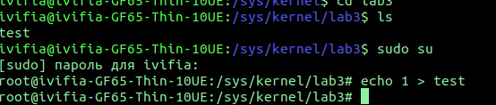

# lab3

## Сборка
```bash
make          # Сборка
make clean    # Очистка
```
## загрузка модуля
```bash
sudo insmod blinks.ko
```
## Бегающие огни на клавиутуре 
При загрузке модуля, огоньки начнут поочередно мигать
## Включение выборочных огоньков
по пути /sys/kernel\lab3 есть файл test, туда записываться битовая маска для включения соотвествующего/cоответсвующих светодиодов
```bash
echo 1 > test
```

