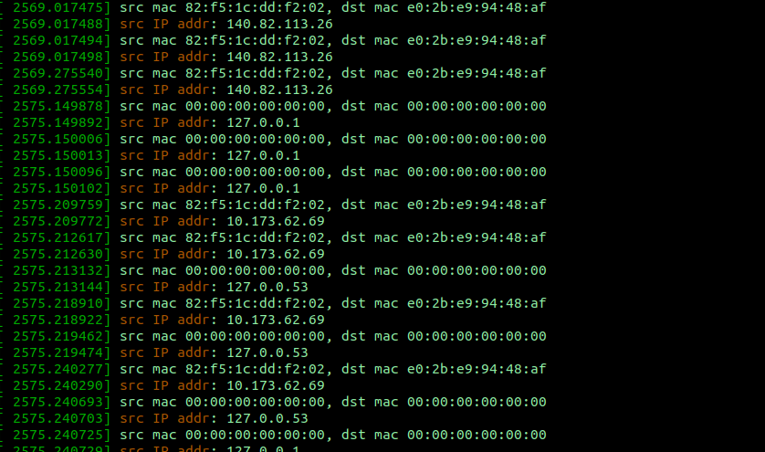
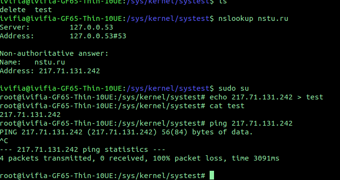
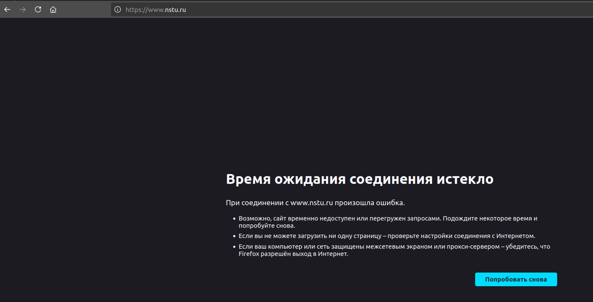
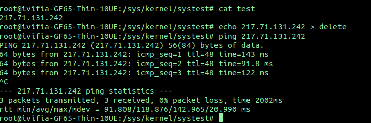

# lab6

## Сборка
```bash
make          # Сборка
make clean    # Очистка
```
## загрузка модуля
```bash
sudo insmod lab6.ko
```
## Сообщения от ядра
```bash
sudo dmesg

```

```bash
```
## Блокировка адресов. Например заблокируем сайт НГТУ
По пути /sys/kernel/systest находятся 2 файла test (черный список для блокировки адресов, я забыл название переменной поменять когда код из 3 лабы копировал) и delete (нужен для удаление адресов которые уже есть в test)
```bash
echo 217.71.131.242 > test
```

## Проверим блокировку через браузер

## Удалим адрес из черного списка
```bash
echo 217.71.131.242 > delete
```
## После этого сайт НГТУ заработал

